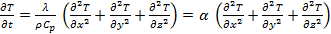
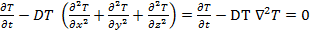

# 20160528オープンCAE勉強会＠富山
# laplacianFoam の改造　温度拡散率分布の付与

富山県立大学　中川慎二

## まえがき

Disclaimer: OPENFOAM® is a registered trade mark of OpenCFD Limited, the producer of the OpenFOAM software and owner of the OPENFOAM ® and OpenCFD ® trade marks. This offering is not approved or endorsed by OpenCFD Limited.

OpenFOAMユーザーガイド，プログラマーズガイド，OpenFOAM Wiki，CFD Online，その他多くの情報を参考にしています。開発者，情報発信者の皆様に深い謝意を表します。

この講習内容は，講師の個人的な経験（主に，卒研生等とのコードリーディング）から得た知識を共有するものです。この内容の正確性を保証することはできません。この情報を使用したことによって問題が生じた場合，その責任は負いかねますので，予めご了承ください。

<a name="notation"></a>
## 本文書での表記方法について

#### 端末から入力するコマンド

端末（ターミナル）で実行するコマンドは，次のように表記する。

> cp a b

#### ファイルやソースコードの内容

ファイル・ソースコード記載事項は次のように表記する。インデント（字下げ）は，必ずしもここに記載通りとは限らない。記入するファイルに合わせて，適切にインデントしてください。

```
    solve
    (
        fvm::ddt(T)
        - fvm::laplacian(DT, T)
    );
```

<a name="tableOfContents"></a>
# Table of Contents

1. [本文書での表記方法について](#notation)
1. [目的](#object)
1. [laplacianFoam 基礎式](#equations)
1. [改造手順](#procedures)
    1. [改造元コードのコピーと名前の変更](#rename)
    1. [温度拡散係数の定義の変更](#defineDT)
    1. [改造ソルバ用例題の用意](#createTutorial)
    1. [例題の実行と動作確認](#run)
1. [なぜ，基礎式のコードは変更しなくて良いのだろう？](#more)
1. [追加の改造？](#moreModification)


<a name="object"></a>
## 目的 

OpenFOAMソースコードの見方，構成，特徴を，実際のファイルを見ながら学ぶ。

ソースコードの見方を学ぶサンプルとして，laplacianFoam を選ぶ。拡散方程式を解くソルバであり，とてもシンプルなソースコードであるため。

[［目次に戻る］](#tableOfContents)

<a name="equations"></a>
## laplacianFoam 基礎式 





上記基礎式は，ソースコードでは次のように表現される。これは，laplacianFoam.C ファイルの一部である。

```
    solve
            (
                fvm::ddt(T) - fvm::laplacian(DT, T)
            );
```

ここで，DTは温度拡散係数[m^2/s]であり，位置によらない一定値と考えられ，dimensionedScalarクラスに基づくオブジェクトとして定義されている。下記は，laplacianFoamディレクトリに含まれるcreateFields.H ファイルでの宣言部分である。

```
    Info<< "Reading diffusivity DT\n" << endl;
    dimensionedScalar DT
    (
        transportProperties.lookup("DT")
    );
```

[［目次に戻る］](#tableOfContents)

<a name="procedures"></a>
## 改造手順

ここから，laplacianFoamソルバを改造する手順を説明する。

<a name="rename"></a>
### 改造元コードのコピーと名前の変更

laplacianFoamディレクトリを，ユーザディレクトリ下($HOME/OpenFOAM/user-3.0.1/solvers/)にコピーする。

> cp -R $FOAM_SOLVERS/basic/laplacianFoam/ $WM_PROJECT_USER_DIR/solvers/


コピー先のディレクトリに移動する。ディレクトリがまるごとコピーされているかを確認する。

> cd $WM_PROJECT_USER_DIR/solvers/
> ls -al ./
> ls -al ./laplacianFoam/


新しいソルバ名を，laplacianMultiRegionFoam とする。
コピーしたディレクトリの名前をlaplacianMultiRegionFoamにする。ディレクトリ名が変更されていることを確認する。

> mv ./laplacianFoam/ ./laplacianMultiRegionFoam/
> ls 


名前を変えたディレクトリの中に移動する。作業の後は，必ず，確認する。

> cd ./laplacianMultiRegionFoam/
> pwd
> ls -al


laplacianFoam.C のファイル名を，laplacianMultiRegionFoam.C 変更する。

> mv laplacianFoam.C laplacianMultiRegionFoam.C
> ls


laplacianMultiRegionFoam/Make/filesの内部を修正する。下記とする。
```
    laplacianMultiRegionFoam.C
    EXE = $(FOAM_USER_APPBIN)/laplacianMultiRegionFoam
```

ここまでの作業に間違いがないかを確認するため，コンパイルする。

> wmake


エラーメッセージが表示されず，$FOAM_USER_APPBIN ディレクトリに，laplacianMultiRegionFoamファイルが作成されていれば，OK。$FOAM_USER_APPBIN がどこに相当するのかは，下記のコマンドを実行すると表示される。

> echo $FOAM_USER_APPBIN


[［目次に戻る］](#tableOfContents)

<a name="defineDT"></a>
### 温度拡散係数の定義の変更

ここから，プログラムの改造作業に入る。

まずは，温度拡散係数を，たった1つのスカラー値（場所によらず一定）から，場所によって異なる値を持つスカラーフィールド値に変更する。つまり，温度拡散係数 `DT` を温度 `T` と同じ種類 `volScalarField` の変数にする。

そのために，定義が書かれている createFields.H ファイルを修正する。

温度と同様に，`DT` をスカラー場とする。元の定義を削除するか，コメントに変更する。

温度 `T` の定義部分をコピーして，`DT` 定義部分に貼付ける。その貼付け部分で，`T` を `DT` に変更する。ここにある２箇所の両方を修正する。

transportPropertiesファイルを読み込む必要がなくなったので，その読み込み部分を削除またはコメントアウトする。

念のため，画面へ出力するメッセージを変更する。そうしておくことで，改造したものを使っていることが明確になる。

修正後のファイル後半部分は，下記の様になる。

```
    //Info<< "Reading transportProperties\n" << endl;

    //IOdictionary transportProperties
    //(
    //    IOobject
    //    (
    //        "transportProperties",
    //        runTime.constant(),
    //        mesh,
    //        IOobject::MUST_READ_IF_MODIFIED,
    //        IOobject::NO_WRITE
    //    )
    //);

    //Info<< "Reading diffusivity DT\n" << endl;

    // dimensionedScalar DT
    // (
    //     transportProperties.lookup("DT")
    // );

    Info<< "Reading diffusivity field DT\n" << endl;

    volScalarField DT
    (
        IOobject
        (
            "DT",
            runTime.timeName(),
            mesh,
            IOobject::MUST_READ,
            IOobject::AUTO_WRITE
        ),
        mesh
    );
```

この改造でコンパイル出来るかを確認する。flangeMultiRegionソルバのディレクトリから，下記コマンドを実行する。

> wmake

[［目次に戻る］](#tableOfContents)

<a name="createTutorial"></a>
### 改造ソルバ用例題の用意

改造ソルバの動作確認用例題を作成する。laplacianFoamの例題をコピーして，名前を変更する。作業結果を確認しながら。

> cp -R $FOAM_TUTORIALS/basic/laplacianFoam/flange/ $FOAM_RUN/
> cd $FOAM_RUN
> ls
> mv ./flange/ ./flangeMultiRegion/
> ls


名前を変えたディレクトリの中に移動する。作業の後は，必ず，確認する。

> cd ./flangeMultiRegionFoam/
> pwd
> ls -al


先ほどのソースコード変更によって，温度Tと同様に，温度拡散係数DTを，0ディレクトリに用意しておく必要がある。そのため，0ディレクトリに存在するTファイルをコピーして，DTファイルを作成する。

> cp ./0/T ./0/DT


DTファイルの内容を修正する。修正すべきことは，単位，変数名，初期値，境界条件である。

`DT` の単位は，m^2/sである。初期値は，オリジナルの例題と同じ値にする。この値は，constantディレクトリ内のtransportPropertiesに記載されている。境界での値を内部と同じにするために，zeroGradient境界条件を指定しておく。

これらの修正を加えたファイルの中身は，下記となる。修正後に保存する。

```
    FoamFile
    {
        version     2.0;
        format      ascii;
        class       volScalarField;
        object      DT;
    }
    // * * * * * * * * * * * * * * * * * * * * * * * * * * * * * * * * * * * * * //
    dimensions      [0 2 -1 0 0 0 0];
    internalField   uniform  4e-05;
    boundaryField
    {
        patch1
        {
            type            zeroGradient;
        }
        patch2
        {
            type            zeroGradient;
        }
        patch3
        {
            type            zeroGradient;
        }
        patch4
        {
            type            zeroGradient;
        }
    }
    // ************************************************************************* //
```

このDTファイルは，内部の分布を設定するときに書き換えられる。いつでも元の状態にもどせるように，バックアップファイルを作成しておく。

> cp ./0/DT ./0/DT.orig


このままでも良いのだが，不要となったtransportPropertiesファイルを削除する。誤って，一定値のDTを読み込んでいることに気づかないというミスや，transportPropertiesファイル内の値を変えて計算結果が変わるという誤解をなくすためである。

DTファイルに，場所毎の温度拡散係数を指定するために，OpenFOAM付属ユーティリティーである `setFields` を使う。その設定ファイル setFieldsDict を作成する。

ユーティリティーの設定ファイルを作成する際には，(1)他の例題のファイルを参考にする，または，(2)ソースコードととともに用意されている設定ファイルを参考にする，の2つの方法がある。今回は，方法(2)を使う。

ユーティリティーのソースコードは，$FOAM_APP/utilities/ に保存されている。この中の，preProcessing/setFields/ ディクショナリを開いて，setFieldsDict が存在することを確認する。このファイルを，先ほど作成した例題のsystemディレクトリにコピーする。

> cp $FOAM_APP/utilities/preProcessing/setFields/setFieldsDict $FOAM_RUN/flangeMultiRegion/system/


コピーした先のファイルの内容を，下記のように変更する。これは，領域全体のDTをデフォルト値の `4e-5` にした後，対角の2点で指定した箱形領域内部での `DT` の値を `4e-6` にするものである。

```
    // * * * * * * * * * * * * * * * * * * * * * * * * * * * * * * * * * * * * * //
    defaultFieldValues
    (
        volScalarFieldValue DT 4e-05
    );
    
    regions
    (
        boxToCell
        {
            box (0 -0.1 -0.1) (0.05 0.1 0.1);
            fieldValues
            (
                volScalarFieldValue DT 4e-06
            );
        }
    );
    // ************************************************************************* //
```

例題のsystem/controlDict ファイルには，application 欄に使用するソルバ名を記載しておく。ソルバ名を指定して実行する際には，この項は無視されるが，Allrunスクリプト等での自動実行時には，このappication欄で指定したソルバが使用される。
```
    application     laplacianMultiRegionFoam;
```

例題実行用スクリプトAllrun を修正し，DTの初期値をsetFieldsユーティリティで指定するようにする。
例題ディレクトリのAllrunスクリプトを開き，次の2行をソルバ実行行（runApplication $application）の直前に挿入する。1行目は，初期のDTを一様値に戻しておくためである。（なくてもよい。）
```
    cp 0/DT.orig 0/DT
    runApplication setFields
```

Allcleanスクリプトファイルに，0/DTの削除を追加する。
```
    rm -f 0/DT > /dev/null 2>&1
```

以上で，準備が完了した。


[［目次に戻る］](#tableOfContents)

<a name="run"></a>
## 例題の実行と動作確認

例題ディレクトリから，Allrunスクリプトを実行する。Paraviewにより，初期のDTが指定した通りになっていることを確認する。計算結果の温度分布から，温度拡散係数分布の影響が正しく反映されているかを確認する。

このように，プログラム・機能の使い方を確認するために，その機能を利用する例題を作成する。OpenFOAMの活用・理解するためには，添付されている例題を実行し，その意味を理解していくことが重要である。

以上は，ごく基本的なソースコードの改造方法を紹介したものである。このコードの正しさ，正当性ついては，使用者自身の責任で確認する必要がある。

|  |
|:-------:|
|  Figure 改造前の実行結果  |

|  |
|:-------:|
|  改造後の実行結果  |

|   |
|:-------:|
| 温度拡散係数の分布 |


[［目次に戻る］](#tableOfContents)


<a name="more"></a>
## なぜ，基礎式のコードは変更しなくて良いのだろう？

上記の改造では，ソースコード中の基礎式は変更しなかった。つまり，改造前と後で，ソースコード上の基礎式は同一であり，下記となっている。

```
    solve
    (
        fvm::ddt(T)
        - fvm::laplacian(DT, T)
    );
```

改造前と後では，DTの定義を変更した。それなのに，基礎式のコードを変更しなくて良いのはなぜであろう？

上記のコードは，表面上は同一であるが，実際には，計算に使われるlaplacian関数が異なることになる。これは，改造前のDTが dimensionedScalar クラスのオブジェクトであるのに対して，改造後のDTは volScalarFieldクラスのオブジェクトであるためである。

このように，同じ名前の関数（laplacian関数）でありながら，引数として受取るオブジェクトの種類に応じて適切な関数を選択する仕組みは，C++言語に用意されたオーバーロード（多重定義）という機能で実現されている。

このオーバーロードの仕組みがあることで，DTの定義を変更するだけで，同一の基礎式として記述したコードを修正なしで利用できることになる。

このオーバーロード機能は，コードの作成にあたって，とても便利な機能である。その一方で，初心者がOpenFOAMコードを読み解くとき，混乱を招く原因にもなる。OpenFOAMのコード内には，laplacianと名付けられた関数が多数存在する。実際に使われる関数のコードを見るためには，引数の種類と数をしっかりと把握することが大切である。


[［目次に戻る］](#tableOfContents)

<a name="moreModification"></a>
## 追加の改造

上記の改造では，ソースコード中の基礎式は変更しなかった。しかし，拡散係数が空間的に変化することを考えると，ラプラシアン項の他に，拡散係数の勾配に依存する項を考える必要がある。

これについては，流体の粘度が一定値である場合のソルバ icoFoam.C と，流体の粘度が場所によって変化する場合のソルバ nonNewtonianIcoFoam.C とで，基礎式のコードを見比べると良い。下記のようなコードが考えられる。

```
    solve
    (
        fvm::ddt(T)
        - fvm::laplacian(DT, T)
        - (fvc::grad(T) & fvc::grad(DT))
    );
```
ベクトル，テンソルの演算と，OpenFOAMコードでの表現方法については，OpenFOAM Programmer’s Guide の1.4節にまとめられている。

式の離散化，fvm と fvc については，OpenFOAM Programmer’s Guide の2.4節で説明されている。


[［目次に戻る］](#tableOfContents)
